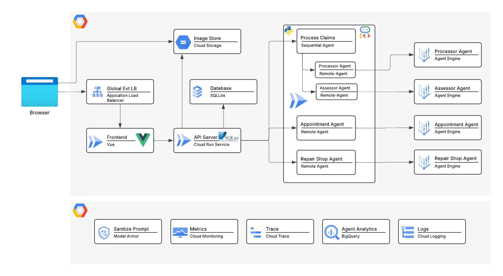

# Building Plan Compliance Checker

[](https://github.com/srinandan/building-permit/actions/workflows/ci.yml)
[](./LICENSE)
[](./api/go.mod)
[](./agent/pyproject.toml)
[](./frontend/package.json)
[](https://github.com/srinandan/building-permit/actions/workflows/codeql.yml)

An Agentic application to review building plans against the California Building Standards Code and San Paloma County reach codes.

> **Note**: San Paloma is a fictitious county used for the purpose of this demonstration.

## Architecture



This is a monorepo containing:
1. **Frontend**: React application built with Vite and Tailwind CSS.
2. **API Gateway**: Go backend using the Gin framework to handle file uploads and orchestrate the AI analysis.
3. **Compliance Agent**: Python service using FastAPI, Google Cloud Document AI, Vertex AI RAG Engine, Model Armor, and Gemini for building plan analysis.
4. **Contractor Agent**: A2A-compliant Python service for finding licensed contractors using Gemini and Google Search.
5. **Assessor MCP Server**: Python service providing county property and zoning data via the Model Context Protocol (MCP).
6. **Agent Engine**: Vertex AI Agent Engine for deploying and scaling the AI components, including centralized session management and memory.

## Documentation & Agent Skills

- **`plan/`**: Contains the project specifications and DESIGN documentation.
- **`.agents/`**: Contains the AI agent's skills and configurations.


## Prerequisites

- Node.js & npm (for the frontend)
- Go (for the API gateway)
- Python 3.12+ & `uv` (for the AI Agent)
- Google Cloud Project with Billing enabled
- Google Cloud Service Account with permissions for Vertex AI and Document AI

## Google Cloud Setup

### 1. Automated Infrastructure Setup

We provide a set of scripts in the `infra` directory to automate the one-time setup of GCP APIs, Service Accounts, and the Vertex AI RAG Engine.

```bash
cd infra
make setup
```

This will:
- Enable necessary APIs (Vertex AI, Document AI, Telemetry, etc.).
- Create a service account `build-permit-sa` with the required IAM roles.
- Create a Vertex AI RAG Corpus named `ca-building-codes` in `us-west1` and upload documents from `building-codes/`.
- Deploys the Vertex AI Agent Engine using the logic in the `agent-engine/` directory.

To dynamically onboard your deployed agents to the Agent Registry, run from the `infra` directory:
```bash
make onboard
```

### 2. Manual Setup (Document AI)

After running the automated setup, you need to manually create a Document AI Processor:
- Go to the [Document AI console](https://console.cloud.google.com/ai/document-ai/processors).
- Click **Create Processor** and select **Document OCR**.
- Note the **Processor ID** and add it to your `.env` file in the `agent` directory.

## Local Development

### 1. Installation

Install dependencies for all components:
```bash
make install
```

### 2. Execution

Start all microservices in the background:
```bash
make all
```

### 3. Deployment

To deploy all components to Google Cloud Run:
```bash
make deploy
```

Stop all background microservices:
```bash
make stop
```

### 3. Individual Component Setup

For detailed setup, configuration, and individual execution of each component, refer to their respective READMEs:
- **[Frontend](./frontend/README.md)**: React application setup and styling.
- **[API Gateway](./api/README.md)**: Go backend and user management.
- **[Compliance Agent](./agent/README.md)**: Python AI analysis and RAG setup.
- **[Contractor Agent](./contractor-agent/README.md)**: A2A communication and discovery.
- **[Assessor MCP Server](./assessor-mcp-server/README.md)**: Model Context Protocol tools.
- **[Agent Engine](./agent-engine/README.md)**: Vertex AI deployment utilities.
- **[Infrastructure](./infra/README.md)**: Automated GCP provisioning.

## Usage

1. Open `http://localhost:3000` in your browser.
2. Upload a sample PDF building plan.
3. The frontend will send the PDF to the Go API, which forwards it to the Python Agent.
4. The Python Agent will extract text using Document AI, query the RAG engine for relevant codes, optionally sanitize user prompts with Model Armor (if `ENABLE_MODEL_ARMOR=true`), and use Gemini to generate a compliance report.
5. The UI will display the results, including specific code violations and suggestions.

## Built With

This application was built with the assistance of [Stitch](https://stitch.withgoogle.com/) and [Jules](https://jules.google.com).

## Contributing

Please see [CONTRIBUTING.md](./CONTRIBUTING.md) for details on how to contribute to this project.

## Support

This demo is *NOT* endorsed by Google or Google Cloud. The repo is intended for educational/hobbyists use only.

## License

This project is licensed under the terms of the [LICENSE](./LICENSE) file.
